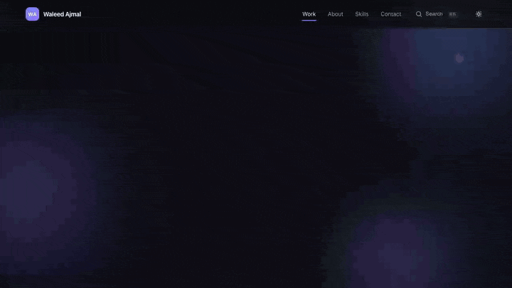
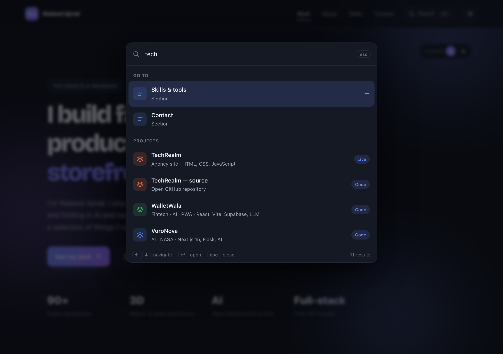
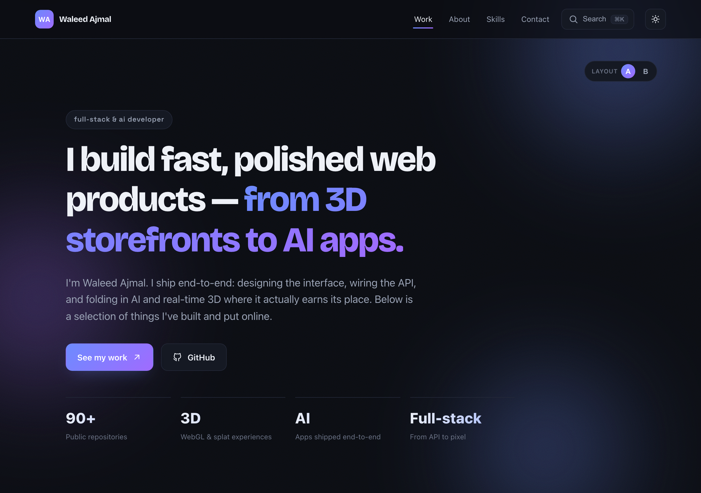
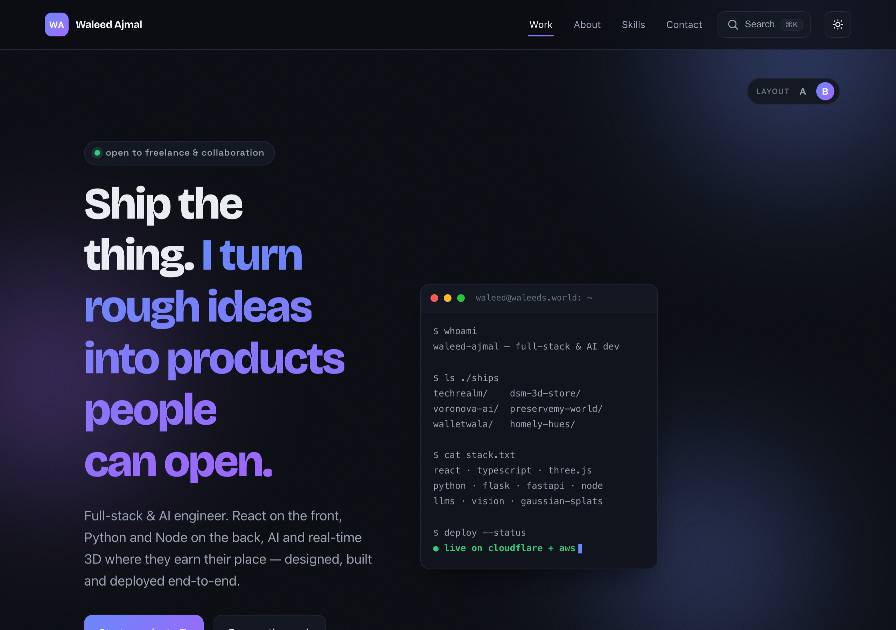
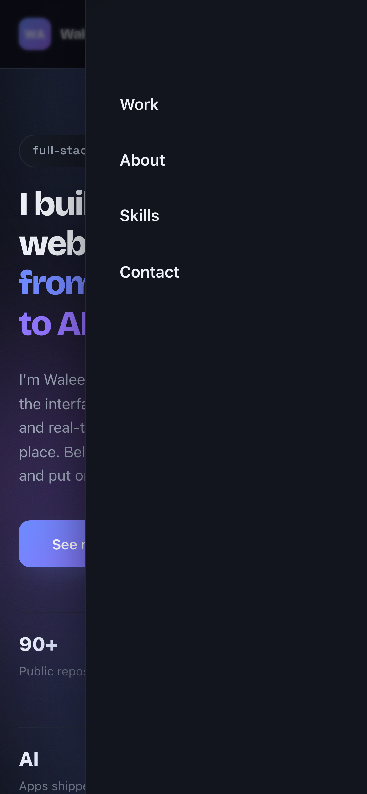
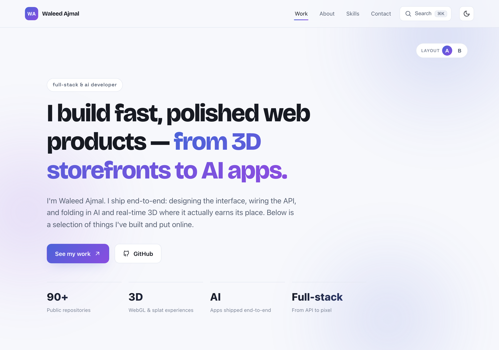

# Waleed Ajmal — Portfolio

<p>
  <a href="https://waleeds.world"></a>
  
  
  
  
  
</p>

> The personal site of **Waleed Ajmal** — full-stack & AI developer. Hand-built,
> no templates, no page-builder. It ships end-to-end the same way I do: designed,
> wired, and deployed. Live at **[waleeds.world](https://waleeds.world)**.



<p align="center"><em>One take: scroll-spy nav, spotlight cards, ⌘K command palette, a light/dark flip, and the A→B hero swap.</em></p>

---

## Why it's more than a résumé page

Most portfolios are a scroll and a shrug. This one is a small product — keyboard-driven,
accessible, theme-aware, and A/B-testable — so it actually shows the craft instead of
just claiming it.

### ⌘K command palette — because clicking is *so* last decade

Hit <kbd>⌘K</kbd> / <kbd>Ctrl</kbd>+<kbd>K</kbd> (or just `/`) anywhere and a fuzzy
launcher slides in. Jump to any section, search every project by name, tag or tech
stack, open a live site or its source, or flip the theme — all without touching the
mouse. Full focus-trap, arrow-key navigation, and <kbd>Esc</kbd> to bail.



### A/B landing hero — two heroes, one link

The landing hero ships in **two interchangeable layouts** so the headline and CTA can be
A/B-tested *without a rebuild*. Flip the **Layout A / B** pill live, or deep-link straight
to a variant with `?variant=b`. The choice persists to `localStorage` and rides on
`<html data-variant>`, so a shared link lands on exactly the layout you meant.

| Variant A — narrative hero | Variant B — terminal hero |
| --- | --- |
|  |  |

More detail in **[docs/VARIANTS.md](docs/VARIANTS.md)**.

### Motion that respects you

Scroll-reveal sections, a spotlight that tracks your cursor across project cards, a thin
reading-progress bar, scroll-spy nav highlighting, and a back-to-top button — every one
of them yields the moment your OS says `prefers-reduced-motion: reduce`.

### Genuinely accessible & robust

Skip-to-content link, real landmark roles, `aria-labelledby` on every section,
`aria-current` on the active nav item, visible focus rings, and a slide-in **mobile
drawer nav** with a focus trap and body-scroll lock.

<p align="center">
  
</p>

### Findable by robots *and* humans

Rich meta, Open Graph + Twitter `summary_large_image` (with a purpose-built 1200×630
card), `schema.org` JSON-LD (`Person` / `WebSite` / `ProfilePage`), `sitemap.xml`,
`robots.txt`, a PWA `site.webmanifest`, and a full favicon set.

---

## Under the hood

- **React 18** + **Vite 5** — static SPA, hashed asset chunks, React split into its own vendor bundle for cache-friendly redeploys
- **Plain CSS** with light/dark theming via CSS custom properties — no UI framework, no reset-the-world dependency
- **Vitest** unit tests + **Playwright** e2e smoke tests, wired into **GitHub Actions** CI
- Deployed on **Cloudflare Pages** (`npm run build` → `dist/`)

## Quick start

New here? Three commands and you're running it locally:

```bash
git clone https://github.com/waleedsworld/a-myportfolio.git
cd a-myportfolio
npm install
npm run dev          # → http://localhost:5173  (hot reload)
```

Then press <kbd>⌘K</kbd> and poke around.

## Scripts

| Command                 | What it does                                     |
| ----------------------- | ------------------------------------------------ |
| `npm run dev`           | Vite dev server with HMR → `http://localhost:5173` |
| `npm run build`         | Production build → `dist/`                        |
| `npm run preview`       | Serve the production build → `http://localhost:4173` |
| `npm test`              | Run the Vitest unit suite                        |
| `npm run test:coverage` | Unit tests with a V8 coverage report             |
| `npm run test:e2e`      | Playwright end-to-end smoke tests                |

## Keyboard shortcuts

| Keys | Action |
| --- | --- |
| <kbd>⌘K</kbd> / <kbd>Ctrl</kbd>+<kbd>K</kbd> | Toggle the command palette |
| <kbd>/</kbd> | Open the palette and start searching |
| <kbd>↑</kbd> <kbd>↓</kbd> | Move through results |
| <kbd>Enter</kbd> | Jump to / open the highlighted item |
| <kbd>Esc</kbd> | Close the palette |

## Structure

```
index.html            document head — SEO, Open Graph, JSON-LD, manifest
src/
  App.jsx             page layout, sections, global ⌘K handler
  Hero.jsx            the A/B landing hero (variants A + B)
  CommandPalette.jsx  the ⌘K launcher (search, focus-trap, keyboard nav)
  MobileNav.jsx       slide-in mobile drawer nav
  useVariant.js       ?variant / localStorage / data-attr state hook
  ui/enhancements.jsx scroll progress, reveal, spotlight cards, scroll-spy
  data.js             curated projects + skills (links to real public repos)
  *.css               theme, component, a11y & variant styles
public/               icons, og-image.png, robots.txt, sitemap.xml, manifest
tests/                Vitest unit + Playwright e2e suites
docs/media/           demo GIF + rendered screenshots
```

## Preview

| Dark | Light |
| --- | --- |
|  |  |

## Deploy

Cloudflare Pages (or any static host):

| Setting          | Value                          |
| ---------------- | ------------------------------ |
| Build command    | `npm install && npm run build` |
| Build output dir | `dist`                         |

## License

MIT © Waleed Ajmal — build on it, remix it, ship your own.
